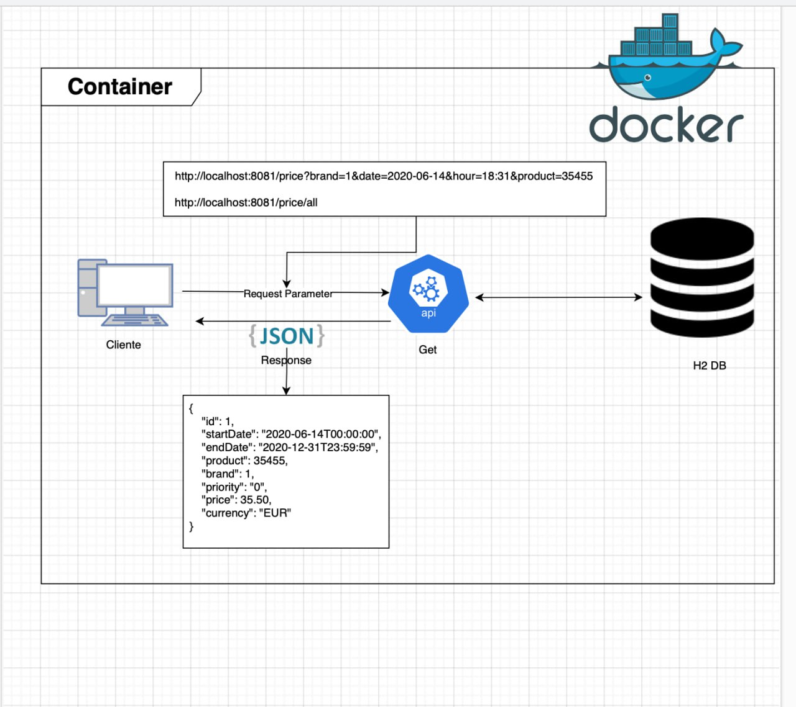

# Proyecto de Prices

## Diagrama Proyecto



## Pre-Requisitos

Asegúrate de tener lo siguiente instalado y configurado:

- **Java 11**: Asegúrate de tener Java 11 instalado en tu sistema y configurado correctamente.
- **IDE para proyectos Java**: Por ejemplo, IntelliJ IDEA.
- **Lombok**: Asegúrate de tener Lombok instalado en su IDE.
- **Maven**: Asegúrate de tener Maven instalado para la gestión de dependencias , en este caso podria usar la version 3.8.1.

## Instalación

_Copiar y ejecutar el siguiente comando en una terminal git_

```bash
git clone https://github.com/lion-m-d/ms-app-price.git
```

_Dirigirse al IDE y importar el archivo_

_En la ruta del proyecto ejecutar el siguiente comando para bajar las dependencias y luego dar un Build_

```
mvn clean install
```
_Visualización de modelos generados por swagger_
- Despues de haber ejecutado el comando anterior
- dirigirse al pom , dar clic derecho
- Seleccionar maven y Generate Sources and Update Folders

## Ejecución

* Dentro del IDE buscar el main que se encuentra en la clase WsAppPriceApplication.java darle click derecho y hacer correr programa (Run)

* Despues de Eso ir a postman y consumir la api : http://localhost:8081/price

## Ejecución con mvn

* Abrir la consola en la ruta del proyecto y ejecutar el comando

```bash 
mvn spring-boot:run 
```

## Ejecución con docker


_Construir Proyecto_
```bash 
mvn clean package
```
_Ejecutar comando docker para crear la imagen_
```bash 
docker build -t ws-app-price:v1 .
``` 
_Ejecutar comando para correr el contenedor que contiene la imagen del proyecto_
```bash 
docker run -p 8081:8081 ws-app-price:v1
``` 

## Documentación

* Para la documentación ir a la ruta : /swagger/open-api.yml
* To access the API documentation, navigate to [swagger-ws-app-price](http://localhost:8081/swagger-ui/index.html#/).
* Se podra ver los endpoint de la api y su funcionalidad. 


